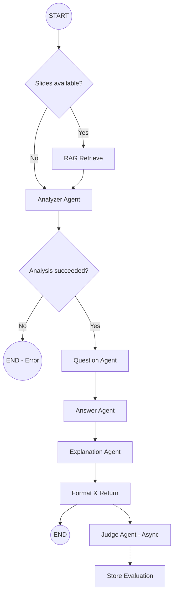

# PRD: LangGraph Agentic Pipeline for QLC Question Generation

## 1. Overview

### 1.1 Problem Statement

The current QLC (Questions about Learners' Code) system uses a monolithic `AIQuestionGenerator` class (1160 lines) in `backend/question_engine/ai_generator.py` that makes sequential raw OpenAI API calls to generate multiple-choice comprehension questions about student Python code. This approach has several limitations:

- **No agent specialisation**: A single mega-prompt handles question generation, correct answers, distractors, and explanations simultaneously, resulting in unfocused output.
- **No access to tools**: The LLM receives serialised analysis JSON as prompt context but cannot query the analysers interactively — it cannot verify its own generated answers.
- **No RAG support**: There is no mechanism to incorporate professor-provided lecture slides or course materials as pedagogical context.
- **Brittle orchestration**: Retry logic, caching, prompt building, and response parsing are all tangled together in one class.

### 1.2 Proposed Solution

Replace the current monolithic AI integration with a **LangGraph StateGraph** pipeline of specialised agents. Each agent has a focused role, its own optimised prompt, and access to specific tools (static/dynamic analysers, RAG retriever). This enables:

- **Decomposed responsibilities**: Each agent does one job well.
- **Tool-calling**: Agents can invoke the static/dynamic analysers as tools to verify their own outputs.
- **Conditional RAG**: When lecture slides are available, they are embedded and retrieved to enrich question context.
- **Async background evaluation**: The judge agent runs asynchronously after questions are returned to the student.

### 1.3 Research Context

Based on: Lehtinen, T., Santos, A. L., & Sorva, J. (2021). *Let's Ask Students About Their Programs, Automatically*. arXiv:2103.11138

### 1.4 Model Strategy

All agents use **OpenAI models**. Recommended model assignments:

| Agent | Model | Rationale |
|-------|-------|-----------|
| Analyzer Agent | `gpt-4o-mini` | Fast, cheap; just orchestrates tool calls |
| Question Agent | `gpt-4o` | Needs strong pedagogical reasoning |
| Answer Agent | `gpt-4o` | Must craft precise correct answer + plausible distractors |
| Explanation Agent | `gpt-4o-mini` | Generating text explanations; speed matters |
| Judge Agent | `gpt-4o` | Critical evaluation requires strong reasoning |
| Test Driver Agent | `gpt-4o-mini` | Simple code generation task |
| RAG Embedding | `text-embedding-3-small` | Cost-effective dense embeddings |

> [!NOTE]
> All models are OpenAI. The specific model choices can be overridden via `GenerationConfig`. If budget is not a concern, all agents can use `gpt-4o`.

---

## 2. Pipeline Architecture

### 2.1 High-Level Flow

```
┌─────────────┐
│ Student Code │──────────────────────────────────┐
└──────┬──────┘                                   │
       │                                          │
       ▼                                          ▼
┌──────────────┐    ┌───────────────────────────────────┐
│ Lecture Slides│───▶│ RAG: Embed & Retrieve (if avail.) │
│ (optional)    │    └────────────────┬──────────────────┘
└──────────────┘                     │
                                     ▼
                         ┌───────────────────────┐
                         │   Analyzer Agent       │
                         │   Tools:               │
                         │   - static_analyzer()  │
                         │   - dynamic_analyzer() │
                         │   - test_driver_gen()  │
                         └───────────┬───────────┘
                                     │
                                     ▼
                         ┌───────────────────────┐
                         │  Question Agent        │
                         │  (generates question   │
                         │   text ONLY, no answer)│
                         └───────────┬───────────┘
                                     │
                                     ▼
                         ┌───────────────────────┐
                         │  Answer Agent          │
                         │  Tools:                │
                         │  - static_analyzer()   │
                         │  - dynamic_analyzer()  │
                         │  Outputs:              │
                         │  - 1 correct answer    │
                         │  - 3 distractors       │
                         └───────────┬───────────┘
                                     │
                                     ▼
                         ┌───────────────────────┐
                         │  Explanation Agent     │
                         │  (for each distractor: │
                         │   why it's wrong)      │
                         └───────────┬───────────┘
                                     │
                    ┌────────────────┤
                    │                │
                    ▼                ▼
           ┌──────────────┐  ┌──────────────────┐
           │ Return to    │  │ Judge Agent       │
           │ Student      │  │ (async/background)│
           │ (immediate)  │  │ Scores quality    │
           └──────────────┘  └──────────────────┘
```

### 2.2 LangGraph Graph Definition



### 2.3 Conditional Edges

| Edge | Condition | Behaviour |
|------|-----------|-----------|
| `START → rag_check` | Always | Check if `lecture_slides` is provided |
| `rag_check → rag_retrieve` | `state.lecture_slides is not None` | Embed slides, retrieve relevant chunks |
| `rag_check → analyzer_agent` | `state.lecture_slides is None` | Skip RAG entirely |
| `analyzer_ok → END_ERR` | Both static and dynamic analysis fail | Return error |
| `format_response → judge_agent` | Always (async) | Fire-and-forget background task |

---

## 3. State Schema

The central typed state flowing through all nodes:

```python
from typing import TypedDict, Optional, Annotated
from langgraph.graph import add_messages

class QLCState(TypedDict):
    # --- Inputs ---
    source_code: str                          # Student's Python code
    lecture_slides: Optional[str]             # Raw text of lecture slides (if any)
    max_questions: int                        # How many questions to generate
    config: dict                              # GenerationConfig as dict

    # --- RAG ---
    rag_context: Optional[str]                # Retrieved lecture context (if any)

    # --- Analysis ---
    static_analysis: Optional[dict]           # Output of StaticAnalyzer.analyze()
    dynamic_analysis: Optional[dict]          # Output of DynamicAnalyzer.analyze()
    analysis_warnings: list[str]              # Non-fatal warnings
    analysis_errors: list[str]               # Fatal errors

    # --- Questions ---
    questions: list[dict]                     # Question text + metadata (no answers yet)

    # --- Answers ---
    questions_with_answers: list[dict]        # Questions enriched with correct + 3 distractors

    # --- Explanations ---
    questions_complete: list[dict]            # Fully enriched with distractor explanations

    # --- Judge (async) ---
    evaluation: Optional[dict]                # Judge scores (populated asynchronously)

    # --- Metadata ---
    tokens_used: int
    execution_time_ms: float
    from_cache: bool
```

---

## 4. Agent Specifications

### 4.1 Analyzer Agent

**Role**: Run static and dynamic analysis on the student's code. Optionally generate a test driver if the code has no top-level function calls.

**Model**: `gpt-4o-mini`

**Tools available**:

| Tool | Function | Description |
|------|----------|-------------|
| `run_static_analysis` | `StaticAnalyzer.analyze(source_code)` | AST-based structural analysis. Returns functions, variables, loops, classes, comprehensions, etc. |
| `run_dynamic_analysis` | `DynamicAnalyzer.analyze(source_code, test_inputs)` | Executes code with `sys.settrace()`. Returns variable values, loop iterations, function calls, return values. |
| `generate_test_driver` | LLM sub-call | If no top-level calls exist, generates test inputs to drive dynamic analysis. |

**Behaviour**:
1. Always run static analysis first.
2. If static analysis finds functions but no module-level calls, invoke `generate_test_driver` to create test inputs, then append the driver code before running dynamic analysis.
3. Always attempt dynamic analysis (even if static fails partially).
4. Write results to `state.static_analysis` and `state.dynamic_analysis`.
5. If both analyses completely fail, write to `state.analysis_errors` and the graph short-circuits to END.

**System Prompt**:
```
You are a code analysis orchestrator. Your job is to analyse student Python code
by calling the static and dynamic analysis tools. Always run static analysis
first. If the code defines functions but has no top-level calls, generate a test
driver first, then run dynamic analysis with the augmented code.

Report all results faithfully. Do not interpret or summarise — just run the tools
and return their output.
```

### 4.2 Question Agent

**Role**: Generate question *text only* (no answers). Produces questions at different Block Model levels.

**Model**: `gpt-4o`

**Tools available**: None (pure generation).

**Inputs from state**: `source_code`, `static_analysis`, `dynamic_analysis`, `rag_context` (if any), `config`.

**System Prompt**:
```
You are an expert computer science educator specialising in assessing student
understanding of their own code.

You will receive:
1. The student's Python code
2. Static analysis results (code structure)
3. Dynamic analysis results (runtime behaviour)
4. (Optional) Relevant lecture material context

Generate ONLY the question text and metadata. Do NOT generate answers.

For each question, output:
- question_text: The question to ask the student
- question_type: "multiple_choice" (always, for this pipeline)
- question_level: "atom" | "block" | "relational" | "macro"
- difficulty: "easy" | "medium" | "hard"
- context: { line_number, variable_name, function_name, data_type, loop_type }
  (set unused fields to null)
- template_id: "ai_generated_<type>"

Question Levels (Block Model):
- ATOM: Basic language elements (variable values, types, operators)
- BLOCK: Code sections (loop iterations, function returns, conditional branches)
- RELATIONAL: Connections between parts (how function A uses result of B)
- MACRO: Whole program understanding (purpose, algorithm, complexity)

Rules:
- Questions must be answerable from the analysis data provided
- Cover diverse levels and difficulties
- Make questions specific to THIS code, not generic Python trivia
- If lecture context is provided, align questions with taught concepts
```

**Output schema**:
```json
{
  "questions": [
    {
      "template_id": "ai_generated_block",
      "question_text": "How many times does the for loop on line 5 execute?",
      "question_type": "multiple_choice",
      "question_level": "block",
      "difficulty": "medium",
      "context": {
        "line_number": 5,
        "variable_name": null,
        "function_name": null,
        "data_type": null,
        "loop_type": "for"
      }
    }
  ]
}
```

### 4.3 Answer Agent

**Role**: For each question, produce 1 correct answer and 3 plausible distractors. Uses tools to verify correctness.

**Model**: `gpt-4o`

**Tools available**:

| Tool | Function | Description |
|------|----------|-------------|
| `query_static_analysis` | Custom wrapper | Query specific aspects of static analysis (e.g., "what type is variable X?") |
| `query_dynamic_analysis` | Custom wrapper | Query specific runtime values (e.g., "what is the final value of variable X?") |
| `run_code_snippet` | Sandboxed exec | Execute a small code snippet to verify an answer computationally |

**System Prompt**:
```
You are an expert at crafting multiple-choice answers for programming
comprehension questions.

For each question you receive, you must produce:
1. ONE correct answer — verified against the analysis data
2. THREE distractor answers — plausible but wrong

Guidelines for distractors:
- Each distractor must be a COMMON MISCONCEPTION or PLAUSIBLE MISTAKE
- Distractors should be the same "shape" as the correct answer (same type,
  similar length)
- Off-by-one errors, wrong variable references, and type confusion are excellent
  distractors
- Never make a distractor obviously wrong (e.g., "banana" for a numeric question)

IMPORTANT: Use the provided tools to VERIFY your correct answer against the
actual analysis data. Call query_dynamic_analysis to check runtime values,
query_static_analysis to check structure, or run_code_snippet to test
computationally.

For each distractor, note what misconception it targets in the
"misconception_targeted" field.
```

**Output schema**:
```json
{
  "answers": [
    {
      "question_index": 0,
      "correct_answer": {
        "text": "5",
        "verified": true,
        "verification_method": "dynamic_analysis"
      },
      "distractors": [
        {
          "text": "4",
          "misconception_targeted": "Off-by-one: counting from 0 instead of 1"
        },
        {
          "text": "6",
          "misconception_targeted": "Including the stop value in range()"
        },
        {
          "text": "10",
          "misconception_targeted": "Confusing the iterable length with iteration count"
        }
      ]
    }
  ]
}
```

### 4.4 Explanation Agent

**Role**: For each distractor (wrong answer), generate a clear explanation of *why* it's wrong and what misconception it reveals.

**Model**: `gpt-4o-mini`

**Tools available**: None (pure generation).

**System Prompt**:
```
You are a patient computer science tutor. For each wrong answer (distractor) in a
multiple-choice question about student code, write a clear, encouraging
explanation of:

1. WHY this answer is wrong
2. What MISCONCEPTION or mistake would lead a student to pick it
3. A brief LEARNING TIP to avoid this mistake in the future

Keep explanations concise (2-3 sentences each). Use a supportive, educational
tone — never condescending.

Also provide a brief explanation of why the CORRECT answer is correct, referencing
the specific code behaviour.
```

**Output schema**:
```json
{
  "explanations": [
    {
      "question_index": 0,
      "correct_answer_explanation": "The loop runs 5 times because range(5) produces values 0 through 4.",
      "distractor_explanations": [
        {
          "distractor_text": "4",
          "why_wrong": "range(5) produces 5 values (0,1,2,3,4), not 4. The confusion arises from zero-indexing — the loop runs from 0 to 4 inclusive, which is 5 iterations.",
          "learning_tip": "Remember: range(n) always produces exactly n values, starting from 0."
        }
      ]
    }
  ]
}
```

### 4.5 Judge Agent (Background/Async)

**Role**: Independently evaluate each generated question+answer set on 5 pedagogical dimensions. Runs asynchronously after the response is sent to the student.

**Model**: `gpt-4o`

**Tools available**: None (pure evaluation).

**Scoring dimensions** (1-5 each, accuracy and pedagogical_value weighted 2×):

| Dimension | Weight | Description |
|-----------|--------|-------------|
| `accuracy` | 2× | Is the correct answer actually correct per the analysis data? |
| `clarity` | 1× | Is the question unambiguous and well-phrased? |
| `pedagogical_value` | 2× | Does this question help identify understanding gaps? |
| `code_specificity` | 1× | Must you know THIS code to answer, or is it generic trivia? |
| `difficulty_calibration` | 1× | Does the stated difficulty match actual difficulty? |

**Overall score**: `(accuracy*2 + clarity + pedagogical_value*2 + code_specificity + difficulty_calibration) / 7`

**Flagging**: Questions with `overall_score < 3.0` or `accuracy < 3` are flagged.

**System Prompt**: Reuse the existing `JUDGE_SYSTEM_PROMPT` from `judge.py` (lines 22-54), adapted a prompt on the new answer format.

---

## 5. RAG: Lecture Slides Integration

### 5.1 When Slides Are Available

```python
# Conditional edge in the graph
def route_rag(state: QLCState) -> str:
    if state.get("lecture_slides"):
        return "rag_retrieve"
    return "analyzer_agent"
```

### 5.2 RAG Implementation

| Component | Technology | Details |
|-----------|------------|---------|
| Embedding model | `text-embedding-3-small` (OpenAI) | 1536-dim vectors |
| Vector store | In-memory FAISS via LangChain | No external DB needed |
| Chunking | `RecursiveCharacterTextSplitter` | chunk_size=1000, overlap=200 |
| Retrieval | Top-k similarity (k=3) | Retrieved chunks go into `state.rag_context` |

### 5.3 Behaviour

1. **Input**: Raw text of lecture slides (extracted from PDF/PPTX upstream or pasted as text).
2. **Process**: Chunk → Embed → Store in ephemeral FAISS index → Query with student code summary → Retrieve top 3 chunks.
3. **Output**: Concatenated relevant chunks stored as `state.rag_context`.
4. **Downstream usage**: The Question Agent and Answer Agent receive `rag_context` as additional context in their prompts, enabling them to align questions with taught concepts.

### 5.4 When Slides Are NOT Available

The `rag_context` field remains `None`. The Question and Answer agents simply skip the lecture context section in their prompts. No vector store is created.

---

## 6. Tools (LangChain Tool Definitions)

### 6.1 Static Analysis Tool

```python
from langchain_core.tools import tool

@tool
def run_static_analysis(source_code: str) -> dict:
    """Analyse Python source code structure using AST parsing.
    
    Returns structural information including: functions (with params, recursion,
    complexity), classes (with methods, inheritance), variables (with scope, type
    annotations), loops (with type, nesting), conditionals, comprehensions,
    exception handlers, imports, and context managers.
    """
    from backend.analyzers.static_analyzer import StaticAnalyzer
    analyzer = StaticAnalyzer()
    return analyzer.analyze(source_code)
```

### 6.2 Dynamic Analysis Tool

```python
@tool
def run_dynamic_analysis(source_code: str) -> dict:
    """Execute Python code and trace runtime behaviour.
    
    Returns: variable values at each line, final variable values, function call
    arguments and return values, loop iteration counts, recursion depth, stdout
    output, and execution success/failure status.
    
    Code execution is sandboxed with a 5-second timeout and 100MB memory limit.
    """
    from backend.analyzers.dynamic_analyzer import DynamicAnalyzer
    analyzer = DynamicAnalyzer(timeout=5)
    return analyzer.analyze(source_code)
```

### 6.3 Query Analysis Tools (for Answer Agent)

```python
@tool
def query_variable_value(variable_name: str) -> str:
    """Look up the final runtime value of a specific variable from dynamic analysis.
    Returns the value and its type, or 'not found' if the variable doesn't exist.
    """
    # Implemented as a lookup into state.dynamic_analysis["final_variables"]

@tool
def query_function_return(function_name: str) -> str:
    """Look up what a specific function returns when called during execution.
    Returns the return value(s) from dynamic analysis traces.
    """
    # Implemented as a lookup into state.dynamic_analysis["function_calls"]

@tool
def query_loop_iterations(line_number: int) -> str:
    """Look up how many times a loop at a specific line executed.
    Returns the iteration count from dynamic analysis.
    """
    # Implemented as a lookup into state.dynamic_analysis["loop_executions"]
```

---

## 7. Files to Create / Modify / Delete

### 7.1 New Files

| File | Purpose |
|------|---------|
| `backend/question_engine/graph.py` | **Main LangGraph graph definition**: `StateGraph`, nodes, edges, conditional routing. Entry point: `build_graph() -> CompiledGraph`. |
| `backend/question_engine/state.py` | `QLCState` TypedDict and related state types. |
| `backend/question_engine/agents/__init__.py` | Agent package init. |
| `backend/question_engine/agents/analyzer_agent.py` | Analyzer agent node function + tools. |
| `backend/question_engine/agents/question_agent.py` | Question generation agent node function + prompt. |
| `backend/question_engine/agents/answer_agent.py` | Answer + distractor agent node function + tools + prompt. |
| `backend/question_engine/agents/explanation_agent.py` | Distractor explanation agent node function + prompt. |
| `backend/question_engine/agents/judge_agent.py` | Background judge agent node function + prompt. |
| `backend/question_engine/rag.py` | RAG pipeline: chunking, embedding, FAISS retrieval. |
| `backend/question_engine/tools.py` | All `@tool` definitions shared across agents. |

### 7.2 Modified Files

| File | Changes |
|------|---------|
| `backend/api/routes.py` | Update `submit_code` endpoint to invoke `graph.invoke()` instead of `AIQuestionGenerator`. Update `evaluate_submission` to use judge from graph. |
| `backend/api/models.py` | Add `lecture_slides: Optional[str]` field to `CodeSubmissionRequest`. Response models stay compatible. |
| `requirements.txt` | Add: `langgraph`, `langchain-core`, `langchain-openai`, `faiss-cpu`, `langchain-community`. |

### 7.3 Preserved (No Changes)

| File | Reason |
|------|--------|
| `backend/analyzers/static_analyzer.py` | Wrapped as tool, code untouched. |
| `backend/analyzers/dynamic_analyzer.py` | Wrapped as tool, code untouched. |
| `backend/question_engine/answer_validator.py` | No LLM usage, still used for answer validation in `submit_answer`. |
| `backend/question_engine/templates.py` | Enum definitions reused. |
| `backend/database/*` | No changes. |
| `frontend/*` | No changes needed; API response format stays compatible. |

### 7.4 Deleted Files

| File | Reason |
|------|---------|
| `backend/question_engine/ai_generator.py` | Replaced entirely by the LangGraph pipeline. |
| `backend/question_engine/answer_explainer.py` | Responsibility absorbed by `explanation_agent.py`. |
| `backend/question_engine/judge.py` | Responsibility absorbed by `judge_agent.py`. |
| `backend/question_engine/generator.py` | Legacy file, no longer needed. |

---

## 8. API Changes

### 8.1 Updated Request Model

```python
class CodeSubmissionRequest(BaseModel):
    code: str
    max_questions: int = 10
    strategy: StrategyEnum = StrategyEnum.DIVERSE
    allowed_levels: Optional[List[QuestionLevelEnum]] = None
    allowed_types: Optional[List[QuestionTypeEnum]] = None
    allowed_difficulties: Optional[List[str]] = None
    lecture_slides: Optional[str] = None  # NEW: raw text of lecture slides
```

### 8.2 Response Format

The response format stays **backward-compatible**. Each question now includes richer data:

```json
{
  "submission_id": "sub_abc123",
  "questions": [
    {
      "id": "q_xyz789",
      "question_text": "How many times does the for loop execute?",
      "question_type": "multiple_choice",
      "question_level": "block",
      "correct_answer": "5",
      "answer_choices": [
        {
          "text": "5",
          "is_correct": true,
          "explanation": "range(5) produces values 0-4, which is 5 iterations."
        },
        {
          "text": "4",
          "is_correct": false,
          "explanation": "This is wrong because range(5) produces 5 values, not 4. The confusion arises from the fact that it starts at 0."
        },
        {
          "text": "6",
          "is_correct": false,
          "explanation": "range(5) stops before 5, so it does not include a 6th iteration."
        },
        {
          "text": "10",
          "is_correct": false,
          "explanation": "10 is the length of the list, not the number of loop iterations."
        }
      ],
      "difficulty": "medium"
    }
  ],
  "metadata": {
    "total_generated": 5,
    "execution_successful": true,
    "execution_time_ms": 3200.5,
    "rag_used": false,
    "agents_used": ["analyzer", "question", "answer", "explanation"]
  }
}
```

---

## 9. Directory Structure (After Migration)

```
backend/
├── analyzers/
│   ├── __init__.py                    # Unchanged
│   ├── static_analyzer.py             # Unchanged (wrapped as tool)
│   └── dynamic_analyzer.py            # Unchanged (wrapped as tool)
├── question_engine/
│   ├── __init__.py                    # Updated exports
│   ├── graph.py                       # NEW: LangGraph StateGraph definition
│   ├── state.py                       # NEW: QLCState TypedDict
│   ├── tools.py                       # NEW: @tool definitions
│   ├── rag.py                         # NEW: RAG pipeline
│   ├── answer_validator.py            # Unchanged
│   ├── templates.py                   # Unchanged
│   └── agents/
│       ├── __init__.py                # NEW
│       ├── analyzer_agent.py          # NEW
│       ├── question_agent.py          # NEW
│       ├── answer_agent.py            # NEW
│       ├── explanation_agent.py       # NEW
│       └── judge_agent.py             # NEW
├── api/
│   ├── __init__.py
│   ├── app.py
│   ├── models.py                      # Modified (add lecture_slides)
│   └── routes.py                      # Modified (use graph.invoke())
└── database/
    └── ...                            # Unchanged
```

---

## 10. Dependencies

Add to `requirements.txt`:

```
# LangGraph / LangChain
langgraph>=0.2.0
langchain-core>=0.3.0
langchain-openai>=0.2.0
langchain-community>=0.3.0

# RAG - Vector Store
faiss-cpu>=1.7.0
```

> [!IMPORTANT]
> Remove the direct `openai>=1.0.0` dependency — it will be pulled in transitively by `langchain-openai`. Keep `python-dotenv` for environment variable loading.

---

## 11. Invocation Example

### 11.1 How `routes.py` Invokes the Graph

```python
from question_engine.graph import build_qlc_graph
from question_engine.state import QLCState

# Build once at startup
qlc_graph = build_qlc_graph()

@router.post("/api/submit-code")
async def submit_code(request: CodeSubmissionRequest):
    initial_state: QLCState = {
        "source_code": request.code,
        "lecture_slides": request.lecture_slides,  # None if not provided
        "max_questions": request.max_questions,
        "config": { ... },
        # All other fields initialised to None/empty
    }

    result = qlc_graph.invoke(initial_state)

    # result["questions_complete"] has the full question+answer+explanation data
    # result["evaluation"] is populated async by the judge
    return format_response(result)
```

### 11.2 How the Graph Is Built

```python
from langgraph.graph import StateGraph, END

def build_qlc_graph():
    graph = StateGraph(QLCState)

    # Add nodes
    graph.add_node("rag_retrieve", rag_retrieve_node)
    graph.add_node("analyzer_agent", analyzer_agent_node)
    graph.add_node("question_agent", question_agent_node)
    graph.add_node("answer_agent", answer_agent_node)
    graph.add_node("explanation_agent", explanation_agent_node)
    graph.add_node("format_response", format_response_node)
    graph.add_node("judge_agent", judge_agent_node)

    # Conditional entry: RAG or straight to analysis
    graph.set_conditional_entry_point(
        route_rag,
        {"rag_retrieve": "rag_retrieve", "analyzer_agent": "analyzer_agent"}
    )

    # Edges
    graph.add_edge("rag_retrieve", "analyzer_agent")
    graph.add_conditional_edges("analyzer_agent", check_analysis_success,
        {"continue": "question_agent", "error": END})
    graph.add_edge("question_agent", "answer_agent")
    graph.add_edge("answer_agent", "explanation_agent")
    graph.add_edge("explanation_agent", "format_response")
    graph.add_edge("format_response", "judge_agent")
    graph.add_edge("judge_agent", END)

    return graph.compile()
```

---

## 12. Caching Strategy

Retain the existing `ResponseCache` concept but apply it at the graph level:

- **Cache key**: Hash of `(source_code, max_questions, allowed_levels, allowed_difficulties)`.
- **Cache check**: Before `graph.invoke()`, check if a cached result exists.
- **Cache store**: After successful completion, cache the `questions_complete` output.
- **TTL**: 1 hour (configurable).
- **Location**: In-memory (same as current). Can be moved to Redis later.

---

## 13. Error Handling

| Scenario | Behaviour |
|----------|-----------|
| Static analysis syntax error | Set `analysis_errors`, skip dynamic, short-circuit to END with error response |
| Dynamic analysis timeout | Set warning, continue with static-only data |
| Both analyses fail | Short-circuit to END with error |
| LLM rate limit | LangChain's built-in retry with exponential backoff |
| LLM returns malformed JSON | Retry up to 3 times; fall back to error response |
| RAG embedding fails | Log warning, skip RAG, continue without lecture context |

---

## 14. Testing Plan

### 14.1 Unit Tests

| Test File | What It Tests |
|-----------|---------------|
| `tests/test_tools.py` | All `@tool` functions work correctly with mock analysis data |
| `tests/test_state.py` | `QLCState` properly initialised and type-safe |
| `tests/test_agents.py` | Each agent node function produces correct state updates (mock LLM) |
| `tests/test_graph.py` | Full graph execution with mocked LLM calls |
| `tests/test_rag.py` | RAG chunking, embedding, and retrieval |

### 14.2 Integration Tests

| Test | Description |
|------|-------------|
| Full pipeline (no slides) | Submit code → get questions with answers and explanations |
| Full pipeline (with slides) | Submit code + slides → verify RAG context appears in questions |
| Judge async | Verify judge runs and stores evaluation after response |
| Error paths | Submit invalid code → verify graceful error handling |
| API backward compat | Verify existing frontend works without changes |

### 14.3 Existing Tests to Update

- `tests/test_static_analyzer.py` — No changes needed (analyzer unchanged).
- `tests/test_dynamic_analyzer.py` — No changes needed.
- `tests/test_api.py` — Update to pass through the new graph pipeline.
- `tests/test_question_generation.py` — Rewrite to test `graph.invoke()` instead of `AIQuestionGenerator`.

---

## 15. Migration Checklist

```
[ ] 1. Install dependencies (langgraph, langchain-openai, faiss-cpu, etc.)
[ ] 2. Create `state.py` with `QLCState` TypedDict
[ ] 3. Create `tools.py` with @tool wrappers for analysers
[ ] 4. Create `agents/analyzer_agent.py`
[ ] 5. Create `agents/question_agent.py`
[ ] 6. Create `agents/answer_agent.py`
[ ] 7. Create `agents/explanation_agent.py`
[ ] 8. Create `agents/judge_agent.py`
[ ] 9. Create `rag.py` with conditional RAG pipeline
[ ] 10. Create `graph.py` with StateGraph definition
[ ] 11. Update `api/models.py` (add lecture_slides field)
[ ] 12. Update `api/routes.py` (invoke graph instead of AIQuestionGenerator)
[ ] 13. Delete old files (ai_generator.py, answer_explainer.py, judge.py, generator.py)
[ ] 14. Update `question_engine/__init__.py` exports
[ ] 15. Update requirements.txt
[ ] 16. Write/update tests
[ ] 17. End-to-end manual test
[ ] 18. Update README.md
```

---

## 16. Risks & Mitigations

| Risk | Impact | Mitigation |
|------|--------|------------|
| Increased latency (more LLM calls) | Questions take longer to generate | The Answer Agent can batch all questions in one call; Explanation Agent can too. Parallelize where possible. |
| Higher token cost | More API calls = more cost | Use `gpt-4o-mini` for simpler agents; cache aggressively. |
| LangGraph learning curve | Development time | LangGraph docs are excellent; the graph structure is straightforward. |
| RAG quality with bad slides | Irrelevant context injected | Limit to top-3 chunks with similarity threshold; skip if no good matches. |
| Breaking existing tests | CI pipeline fails | Keep API response format identical; update tests incrementally. |
